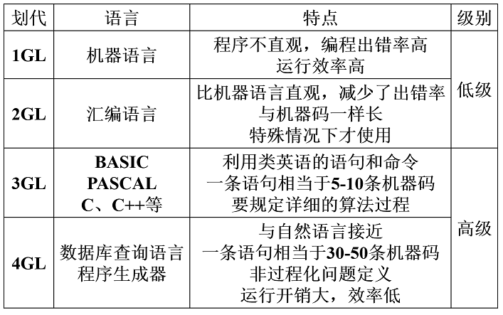
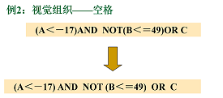
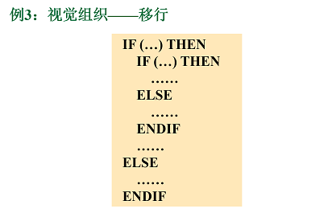
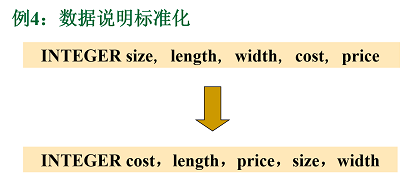
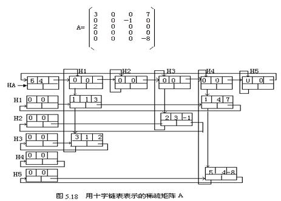
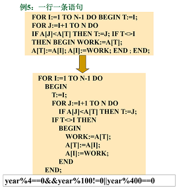
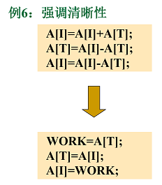
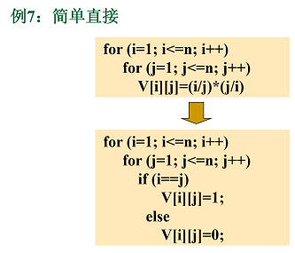
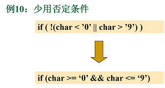

<h1 align="center">第六章  编码及测试</h1>

* [6.1 编码](#61-编码)
	* [6.1.1 选择程序设计语言](#611-选择程序设计语言)
	* [6.1.2 编码风格](#612-编码风格)


* 通常把编码和测试统称为实现。
* 所谓编码就是把软件设计结果翻译成用某种程序设计语言书写的程序。
* 软件测试在软件生命周期中横跨两个阶段。
	* 为发现错误而执行程序的过程。
	* 根据软件开发各阶段的规格说明和程序的内部结构而精心设计的一批测试用例，并利用这些测试用例去运行程序，以发现程序错误的过程，即执行步骤。
* 通过测试发现错误之后还必须诊断并改正错误，这就是调试的目的。调试是测试阶段最困难的工作。

# 6.1 编码
### 6.1.1 选择程序设计语言
* 程序设计语言
	* 机器语言，几乎不使用。
	* 汇编语言，特殊场合使用。
	* 高级语言，明显优于汇编语言。 
* 程序设计语言的划代： 

	<div align="center"></div>

* 选择语言的理想标准：
	* 为了使程序容易测试和维护以减少软件的总成本，所选用的高级语言应该有理想的模块化机制，以及可读性好的控制结构和数据结构；
	* 为了便于调试和提高软件可靠性，语言特点应该使编译程序能够尽可能多地发现程序中的错误；
	* 为了降低软件开发和维护的成本，选用的高级语言应该有良好的独立编译机制。 
* 主要的实用标准：
	* 系统用户的要求
	* 可以使用的编译程序
	* 可以得到的软件工具
	* 工程规模
	* 程序员的知识
	* 软件可移植性要求
	* 软件的应用领域
### 6.1.2 编码风格
* 1. 程序内部的文档
	* 恰当的标识符
		
	  >如SUM和，root根。
 
	* 适当的注解:注释分为序言性注释和描述性注释（功能，状态）。
		* 序言性注释：对整个程序的说明。安排在每个模块的首部。
		* 功能性注释：说明程序段的功能，放在某程序段之前。
		* 状态性注释：说明数据的状态，通常放在程序段之后。
	* 程序的视觉组织
	
	  ```c
	  /* 本模块：求a,b,c三数中最小值。
	  实现思想：先求a，c最小值存入x。再求x，b中较小值存入x*/
	  int min(int a,int b,int c)                     
	  {  
	  	int x;
	  	/* Set     x     to  min（a，c）*/
	  	if (a<c)
	  		x=a;
	  	else   
	  		x=c;
         
	  	/* Set     x     to  min（x，b）*/
	  	if (b<x)
	  		x=b;
	  	/*     x 当前为a，b，c最小*/   
	  	return(x);
	  }
	  ```
	<div align="center"></div>
	<div align="center"></div>

* 2.数据说明
	* 数据说明的次序应该标准化。
	* 在类型说明中还可进一步要求。例如可按如下顺序排列：
		* ①整型量说明
		* ②实型量说明
		* ③字符量说明
		* ④逻辑量说明
	* 当多个变量名在一个语句中说明时，应该按字母顺序排列这些变量。

	<div align="center"></div>

	* 如果设计时使用了一个复杂的数据结构，则应该用注解说明用程序设计语言实现这个数据结构的实现方法和特点。  例：比如十字链表

	  ```c
	  typedef struct OLNode 
	  { 
	  int row,col;/*非零元素的行和列下标*/ 
	  int value; /*非零元素值*/ 
	  struct OLNode *right; /*非零元素所在行表、列表的后继链域*/ 
	  struct OLNode *down; 
	  }OLNode, *OLink;
	  ```

	  >eg:稀疏矩阵的十字链表表示的示例

	  <div align="center"></div>

* 3.语句构造(**目标：结构清晰、易懂性好**)
	* 不要为了节省空间而把多个语句写在同一行；
	* 尽量避免复杂的条件测试；
	* 尽量减少对“非”条件的测试；
	* 避免大量使用循环嵌套和条件嵌套；
	* 利用括号使逻辑表达式或算术表达式的运算次序清晰直观。 
	
	  <div align="center"></div>
	  <div align="center"></div>
	  <div align="center"></div>
	  <div align="center"></div>
	  <div align="center"></div>
	  <div align="center"></div>

* 4.输入输出
	* 对所有输入数据都进行检验；
	* 检查输入项重要组合的合法性；
	* 保持输入格式简单；
	* 使用数据结束标记，不要要求用户指定数据的数目；
	* 明确提示交互式输入的请求，详细说明可用的选择或边界数值；
	* 当程序设计语言对格式有严格要求时，应保持输入格式一致；
	* 设计良好的输出报表；
	* 给所有输出数据加标志。 
* 5.效率
	* 效率主要指处理机时间和存储器容量两个方面。
	* 效率是性能要求，因此应该在需求分析阶段确定效率方面的要求。
	* 效率是靠好设计来提高的。
	* 程序的效率和程序的简单程度是一致的，不要牺牲程序的清晰性和可读性来不必要地提高效率。 
	* 效率问题：
		* 程序运行时间
		* 存储器效率
		* 输入输出的效率


