<h1 align="center">第十章  面向对象需求分析</h1>

* [10.1 分析概述（面向对象需求分析阶段-从业务模型到概念模型）](#101-分析概述面向对象需求分析阶段-从业务模型到概念模型)
* [10.2 类图的基本符号](#102-类图的基本符号)
	* [10.2.1 类图的组成元素](#1021-类图的组成元素)
	* [10.2.2 类图中的关系](#1022-类图中的关系)
* [10.3 类图中类关系的画法](#103-类图中类关系的画法)
	* [10.3.1 关联](#1031-关联)
	* [10.3.2 聚集](#1032-聚集)
	* [10.3.3 泛化(Generalization)](#1033-泛化Generalization)
	* [10.3.4 实现(Realization)](#1034-实现Realization)
	* [10.3.5 依赖(Dependency)](#1035-依赖Dependency)
* [10.4 顺序图含义及画法](#104-顺序图含义及画法)
	* [10.4.1 顺序图](#1041-顺序图)
	* [10.4.2 顺序图组成元素](#1042-顺序图组成元素)
	* [10.4.3 顺序图查看](#1043-顺序图查看)
	* [10.4.4 举例(顺序图画法)](#1044-举例顺序图画法)
* [10.5 分析需求建立对象模型和动态模型（从业务模型到概念模型）](#105-分析需求建立对象模型和动态模型从业务模型到概念模型)
	* [10.5.1 名词分析法](#1051-名词分析法)
	* [10.5.2 识别实体类及类图的方法——CRC分析法](#1052-识别实体类及类图的方法CRC分析法)

#  10.1 分析概述（面向对象需求分析阶段-从业务模型到概念模型）
* 任务：对获取的用例模型进行理解、分析，找出描述问题域和系统责任所需要的类及对象，建造概念模型。
* 概念模型：
	* 对象模型（类图，对象图）
	* 动态模型（顺序图、状态图）
* 一般情况

	<div align="center">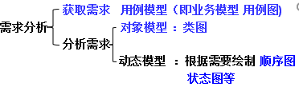</div>
	* 需求分析
		* 获取需求   用例模型（即业务模型 **用例图**)
		* 分析需求
			* 对象模型：**类图**
			* 动态模型：根据需要绘制**顺序图**、**状态图**等

* eg:类图

	<div align="center">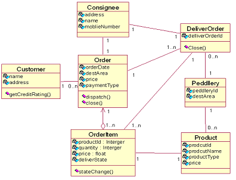</div>

* eg:顺序图

	<div align="center">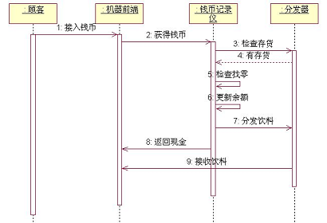</div>

# 10.2 类图的基本符号
### 10.2.1 类图的组成元素
* 类、接口、关系、注释、约束、包

* １、类的表示
	* 类是具有相似结构、行为和关系的一组对象的描述符。
	* （1）类的表示
		* 类中属性和方法、访问限制

	<div align="center">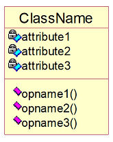</div>

	* （2）类的命名
		* 由字符、数字、下划线组成的惟一的字符串；
		* 采用CamelCase格式（大写字母开头，混合大小写，每个单词以大写开始，避免使用特殊符号）
		* 类名的两种表示方法
			* 简单名   `Order`
			* 路径名　
			  ```
			  java::awt::Rectanget
			  businessRule::Order
			  包名::类名
			  ```
	* （3）类的职责
		* 职责指的是类所担任的任务，即类要完成什么样的功能，要承担什么样的义务。
		* 可以写在document中。
* 2、接口   
	* 接口是一组操作的集合，其中每个操作描述了类或者构件的一个服务。是模型化系统中的接缝。
	* 接口可以实现多态； 
	* 在UML中接口有两种表示方法：
		* rational画法
		* 图标表示法

			<div align="center">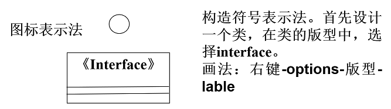</div>
     　
	* 接口：

	  ```java
	  public interface SmallIceCream {
	  	public void taste();
	  }
	
	  public class SmallBananaIceCream implements SmallIceCream {
		  public void taste() {
		  	// TODO Auto-generated method stub
		  	System.out.println("这是香蕉味冰激凌(小份)");
		  }
	  }
	  ```

* 3、关系、注释、约束

	<div align="center">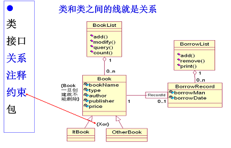</div>

* 4、包

	<div align="center">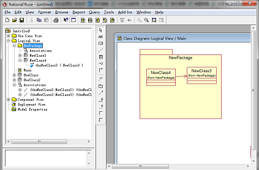</div>

### 10.2.2 类图中的关系
* 类与类之间关系划分为：
	* 关联：包含普通关联、聚集（组合、聚合）等
	* 依赖：一个类调用另一个类的方法，就成这个类依赖于另一个类(友元)
	* 泛化：继承(extends)
	* 实现：implements

	<div align="center">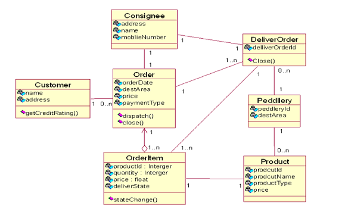</div>

------------

* 一、关联
	* 关联表示两个类的对象之间存在某种语义上的联系，长期的，稳定的。
	* 多重性：某个类的对象可以和另个类的单个对象的联系

	* 1、普通关联
		  
	  >举例：普通关联。
		>* 购物功能：顾客查看订单
		>* 通过订单查看顾客信息
	
		<div align="center">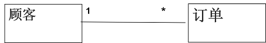</div>
	
		* 关联 ：类与类之间稳定的关系(关系需要存储）
			* 需求阶段：
	
			<div align="center">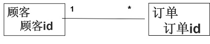</div>
			* 详细设计阶段：
	
			<div align="center">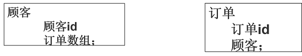</div>
			* 数据库中： 顾客、订单；订单中含顾客id 
			* 稳定的，长期的，为关联关系
			* 表现在代码实现中，一个对象会作为另一个对象的属性是关联。 
			* 关联关系也可以是单向关联，也可以是双向关联。

	* 2、同类对象角色关联
	  
	  >比如记录社区中每个人婚姻状况。</br>
	  >抽取出类：</br>
	  >类的属性：</br>
		>* 身份证号</br>
		>* 年龄</br>
		>* 婚否
                          
		<div align="center">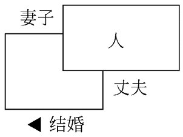</div>

		* 数据库：每人一条记录，记录的配偶字段为配偶身份证号。

	* 3、限定关联：利用限定词把一对多关系简化成了一对一关系。

		<div align="center">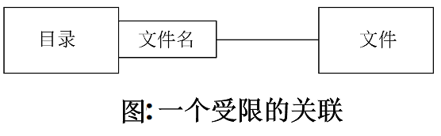</div>

	* 4、关联类：为了说明关联的性质可能需要一些附加信息。这些信息放到关联的任一方都不合适。
		* 可以引入一个关联类来记录这些信息
		* 关联类与一般的类一样，也有属性、操作和关联。
	
			<div align="center">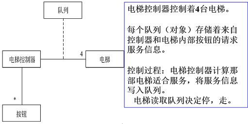</div>
 

* 二、聚集
	* 聚集是关联的特例。聚集表示类与类之间的关系是整体与部分的关系。
	* 一般聚集：

		<div align="center">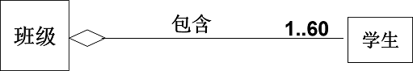</div>
	
	* 两种特殊的聚集关系，分别是聚合和组合。

	-------------

	* 1、聚合
		* 如果在聚集关系中处于部分方的对象可同时参与多个处于整体方对象的构成，则该聚集称为聚合。
		* 聚合的图示符号，在表示关联关系的直线末端紧挨着整体类的地方画一个空心菱形。

		<div align="center">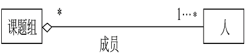</div>

		* 详细设计中 ： 人的集合作为课题组的一个属性；课题组集合作为“人”类的一个属性

		  ```
		  Class 课题组{
		  	person  set persons；
		  }
		  ```

		* 数据库操作中，课题组的删除，不涉及到人员删除。

	* 2、组合
		* 如果部分类完全隶属于整体类，部分与整体共存，整体不存在了部分也会随之消失（或失去存在价值了），则该聚集称为组合聚集（简称为组成）。
		* 组合关系用实心菱形表示。

		<div align="center">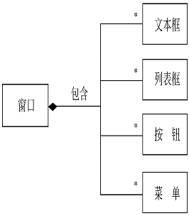</div>

		>例如：记录员工基本信息。员工的地址包含多类信息：email，住所，电话等。为了处理方便，员工与地址，抽象为两个类，为一对多。

		<div align="center">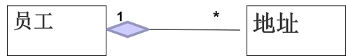</div>

			>>>数据库操作中，员工的删除， 涉及到地址删除。
		
	* 3、关于聚合与组合

		<div align="center">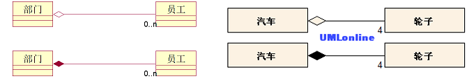</div>

		* “弱”包含表示如果部门没有了，员工也可以继续存在；
    	* “强”包含表示如果部门没有了，员工也不再存在。
		* 在做软件需求时。会将所有的包含关系画成“弱”包含，后面发现某些关系可以表示为“强”包含是，才转为实心菱

* 三、依赖

	* 依赖关系描述两个模型元素（类、用例等）之间的语义连接关系： 其中一个模型元素是独立的，另一个模型元素不是独立的，它依赖于独立的模型元素，如果独立的模型元素改变了，将影响依赖于它的模型元素。
    
	>比如：绘制一个长方形，通过绘制4条线段实现。 </br>
    >长方形与线段之间关系

	   <div align="center">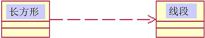</div>
	   <div align="center">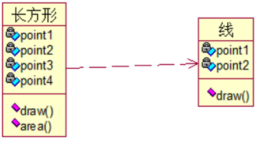</div>

	* 关联与依赖
		* 关联与依赖，哪种关系是持久的，哪种是暂时的？
			
			>关联是很稳定的关系，依赖是弱关系。
		* 关联有可能是双向关系吗？
      
			>是
		* 依赖有可能是双向关系吗？
    
			>否。（有可能设计出来的有，但说明不好）

		* 稳定的，长期的，为关联关系
		* 表现在代码实现中，一个对象会作为另一个对象的属性是**关联**。一个对象用到另一个对象的方法，是**依赖**。
		* 关联关系可以是单向关联，也可以是双向关联。

* 四、泛化（继承关系）
	* UML中的泛化关系就是通常所说的**继承关系**，它是通用元素和具体元素之间的一种分类关系。具体元素完全拥有通用元素的信息，并且还可以附加一些其他信息。
	* 在UML中，用一端为空心三角形的连线表示泛化关系，三角形的顶角紧挨着通用元素。
	* 注意：泛化针对类型而不针对实例，一个类可以继承另一个类，但一个对象不能继承另一个对象。
	* 泛化举例：

	   <div align="center">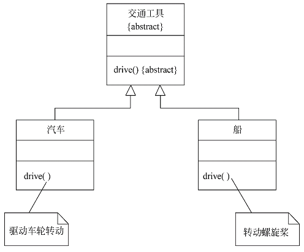</div>

	* 复杂类图示例：

	   <div align="center">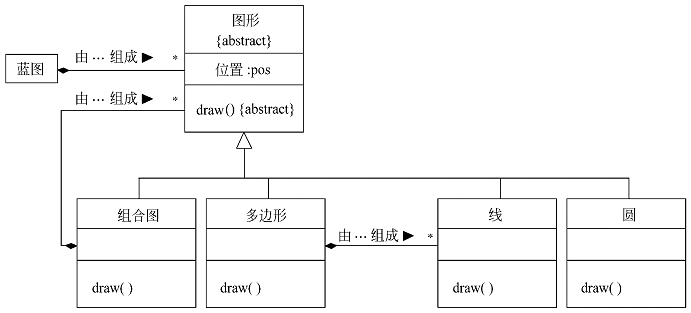</div>

* 五、实现(细化)：对应于类和接口之间的关系

	<div align="center">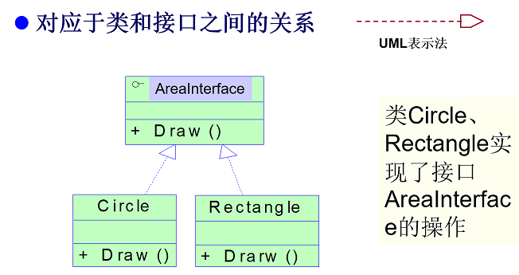</div>

	>eg:

	```java
	circle  c=new circle( 1);
	AreaInterface ac=(AreaInterface)c;
	ac.area();
	ac.toString();
	System.out.println(ac.toString());
	
	Rectangle rc=new Rectangle(2,3);
	ac=(AreaInterface)rc;
	ac.area();
	System.out.println(ac.toString());
	```

* 六、总结
	* 两个类之间，分析是否为泛化、依赖。
	* 如果不是，分析是否是聚合、组合。
	* 如果不是，考虑是否存在关联类、自身关联。
	* 如果不是，为普通关联。


# 10.3 类图中类关系的画法

### 10.3.1 关联

* 关联有名称、角色、多重性和导航性等语法。

	<div align="center">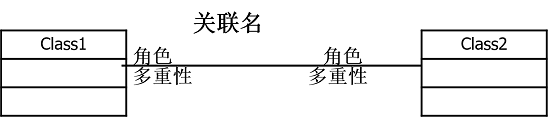</div>

* 1、关联名
	* 描述关联的作用；
	* 通常使用动词或动词短语；

	<div align="center">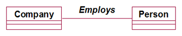</div>

	* 操作：选中关联，双击，定义
* 2、角色
	* 关联两端的类可以某种角色参与关联；
	* 通常使用名词或名词短语；

	<div align="center"></div>

* 3、多重性
	* 某个类有多个对象可以和另一个类的单个对象关联；

	<div align="center">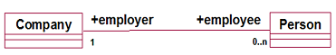</div>

* 4、导航性 —— 工具栏工具来画
	* 用箭头显示导航性；
	* 描述源对象通过链接访问目标对象；
	* A类有一个成员变量保存的是B类的一个引用，也就是说由A类可以找到B类，可以画成下图所示

	<div align="center">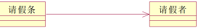</div>

* 5、关联的约束：工具-ABC来画
	* 关联可加上一些约束，以加强关联的含义；

	<div align="center">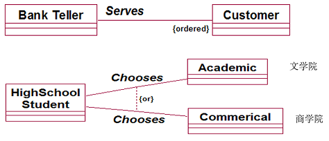</div>

	* 一个BankTeller为顾客服务，但是服务的顺序要按照顾客排队的次序进行。在模型中可以通过在Customer类附近加上一个花括号括起来的“ordered（有序）”来说明这个规则，也就是指明约束。
	* 另一种类型的约束是OR关系，图中标明高中生（high school student）选（choose）专业课（academic,文学的），或者选商务课（commercial）时的模型。

* 6、限定符--右击关联New Key/Qualifier
	* 在关联端紧靠源类图标处可有限定符，带有限定符的关联称为限定关联。
	* 限定符的作用：用于将一个多（或一）对多关联转化为一个多（或一）对一关联。
	* 限定符是关联的属性，而不是类的属性。

	<div align="center">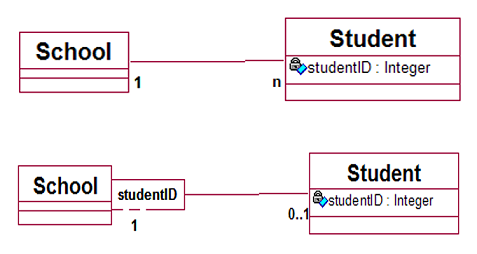</div>

* 7、关联的种类
	* 自返关联
	* 二元关联(前述)

	<div align="center">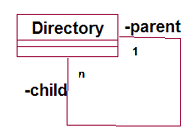</div>


### 10.3.2 聚集
* 1、聚合- 工具 Aggregation 
	* 类之间的一种整体与部分的关系
	* 体现了一种层次结构，整体类位于部分类的上层，多个部分类处于并列的层次

	<div align="center">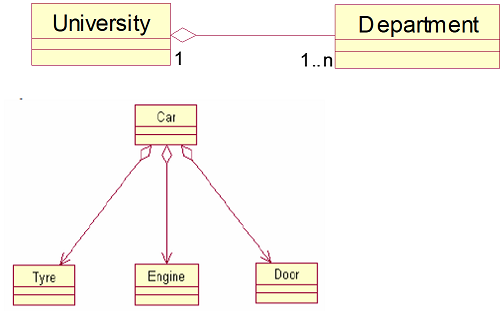</div>

* 2、组合
	* 是一种特殊形式的聚合（强聚合），聚合中的每个部分只能属于一个整体；

	<div align="center">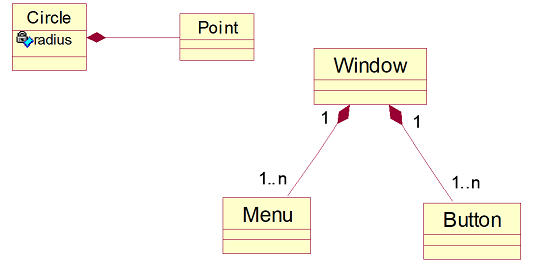</div>

* 3、关于聚合与组合

	<div align="center">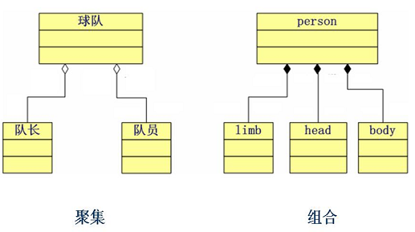</div>

### 10.3.3 泛化(Generalization)
* 表示两个类元间“一般”与“特殊”的关系。
* 对应面向对象编程语言中类与类之间的**继承关系**。

	<div align="center">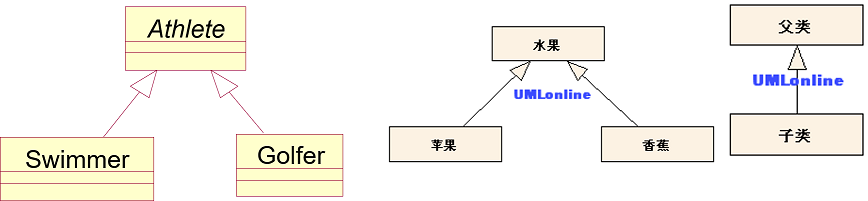</div>

### 10.3.4 实现(Realization)
* 表达一种说明元素与实现元素之间的关系；
* 类和接口之间的关系是实现关系，表示类实现接口提供的操作
* 显示一个类引用另一个类

	<div align="center">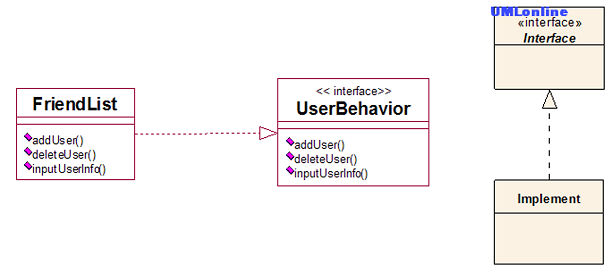</div>

### 10.3.5 依赖(Dependency)
* 软件开发中，往往会设计一些公用类，供别的类调用，如果这些公用类出问题了，那调用这些公用类的类都会因此而出问题。 
* 如果一个烟鬼嗜烟如命，用类图可以这样表示：

	<div align="center">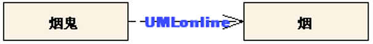</div>

# 10.4 顺序图含义及画法
* 在UML中，我们将顺序图分为两类，一类用于描述系统需求，构造系统的需求模型（分析模型）；另一类用于指导设计与实现，构造系统的实现模型（设计模型）。
* 在系统分析时，可以通过顺序图来对执行者和系统的交互过程进行建模，方便用户更好地理解系统的工作流程。
* 对于需求模型顺序图，一般使用用户熟悉的业务语言来进行系统描述，不涉及到实现细节，一方面方便用户理解，另一方面可以指导类图的设计。

### 10.4.1 顺序图
* 顺序图：又称时序图，描述对象之间的动态交互关系，着重表现参与交互对象的生命线和它们交换的信息。 
* 通常，每一个用例建立一张顺序图。 
* 也可以，一个用例建立几张顺序图。  

  >"饮料自动售货机"顺序图

    <div align="center">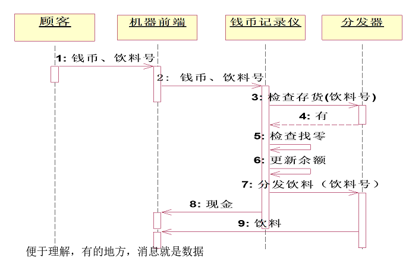</div>

### 10.4.2 顺序图组成元素
* 组成元素
	* 对象-- Object
	* 生命线-- Lifeline
	* 消息-- Message
	* 控制焦点（激活）-- Activation

* 1、对象
	* 对象的命名方式有三种：
		* 显示对象名和类名
		* 只显示类名（匿名对象）
		* 只显示对象名（不关心类）

    <div align="center">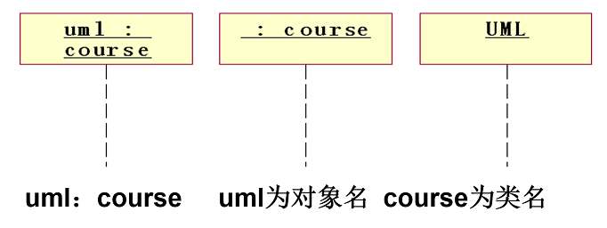</div>

* 2、生命线
	* 表示对象存在的时间。
	* 如果对象生命期结束，则用注销符号表示。

    <div align="center">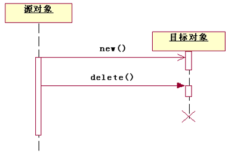</div>

* 3、控制焦点（激活期）
	* 对象执行某个动作的时期。

    <div align="center">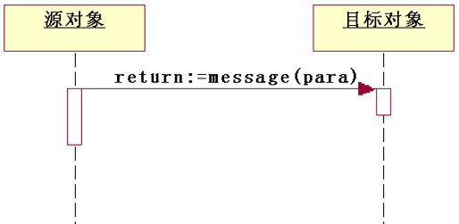</div>

* 4、消息 ：掌握含义及符号
	* 对象间交互信息的方式
	* UML中5种消息 （后续逐渐来看）

    <div align="center">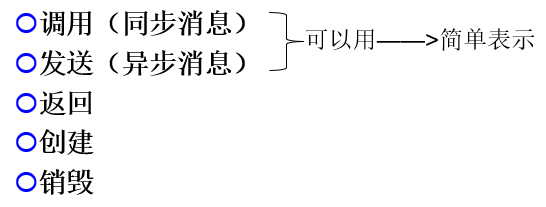</div>

	----------
	
	* （1）调用消息
		* 发送者把消息发送后，等待，直到接收者返回控制。
 
          <div align="center">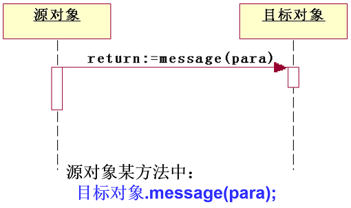</div>

		* 可表示同步。

	* （2）发送消息
		* 消息发送后，发送者继续操作，不等待。
		* 常用于表示异步。  
		* 符号  

		    <div align="center">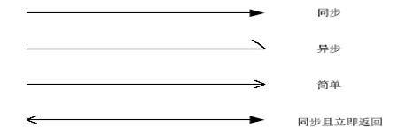</div>

			>举例：自动锁车系统

		    <div align="center">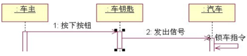</div>

		* 异步：消息可以是一个信号或一次操作调用，收到消息即为事件。可以有两种消息，一种是**从发送者向接收者发送信号**，另一种是**由调用者调用接收者的操作**。

			>异步举例：
			
			```java
			class Lefthand implements Runnable {
			    public void run() {
			        for (int i = 1; i <= 109; i++) {
			            System.out.println("我是左手线程");
			        }
			    }
			}
			class Righthand implements Runnable {
			    public void run() {
			        for (int i = 1; i <= 109; i++) {
			            System.out.println(“我是右手线程");
			        }
			    }
			}
			public class Example  {
			    public static void main(String args[]) {
			        Thread left = new Thread(new Lefthand());
			        Thread right = new Thread(new Righthand());
			        left.start();
			        right.start();
			       for (int i = 1; i <= 100; i++) {
			            System.out.println("我是主线程");
			        }
			    }
			}
			```

		* 发送信号

			```c
			#include <stdio.h>
			#include <unistd.h>
			#include <signal.h>
			#include <sys/types.h>
			#include <sys/wait.h>
			int main()
			{
			    pid_t pid;
			    int status;
			    pid= fork() ;
			    if( 0==pid )
			    {
			        printf("Hi I am child process!\n");
			        sleep(10);
			    }
			    else if ( pid > 0 )
			    {
			        printf("send signal to child process (%d) \n",pid);
			        sleep(1);
			   		/*发送SIGABRT信号给子进程，此信号引起接收进程异常终止*/
			        kill(pid ,SIGABRT);
			   		/*等待子进程返回终止信息*/
			        wait(&status);
			        if(WIFSIGNALED(status))
			            printf("chile process receive signal %d\n",WTERMSIG(status));
			    }else{
			        perror("fork error") ;
			        return -1 ;
			    }
			    return 0 ;
			}
			```
	* （3）返回消息
		* 表示消息的返回。一般同步的返回不需画出，直接隐含，而异步返回则可用它。

		    <div align="center">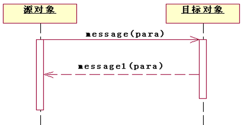</div>

		* 自调用
			* 表示某对象调用自己的操作。 

		         <div align="center">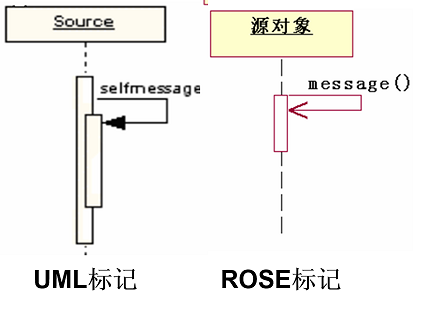</div>

	* （4）创建
    	* 通常利用构造方法来实现，对象一创建，生命线就开始了。
	* （5）销毁
         * 生命终止符号用一个较大的叉形符号表示。

			<div align="center">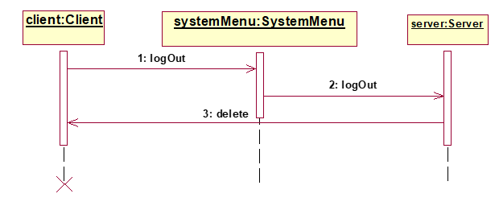</div>
			<div align="center">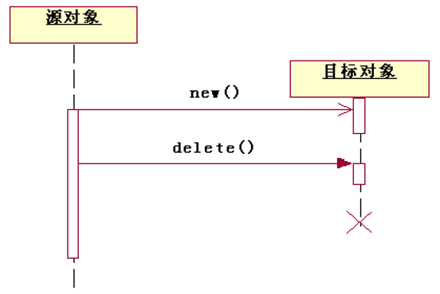</div>

### 10.4.3 顺序图查看
* 浏览方法：从上到下查看对象间交互

	<div align="center">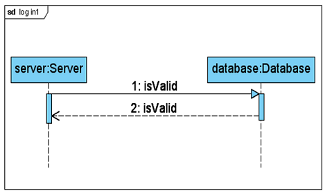</div>

### 10.4.4 举例(顺序图画法)
* 一、买饮料的正常场景，下面是买到饮料的一般事件流：
	* １、顾客从机器的前端钱币口投入钱币，然后选择想要的饮料；
	* ２、钱币到达钱币记录仪，记录仪更新自己的存储；
	* ３、记录仪通知分配器分发饮料到机器前端；
	* 可选事件流：
		* 1>饮料缺货
		* 2>没有零钱可找

	------------

	* "饮料自动售货机"顺序图
		
		<div align="center"></div>

		* 注意
			* 在**需求分析阶段**，顺序图的“消息”上可以是“数据”，也可以是“操作（传送的数据）”。
			* 在**设计阶段**，顺序图的“消息”上，必须为“操作（参数,..)”。需求阶段的“消息”如果为“数据”，在设计阶段会将起转换为“操作”。
	
	* 顺序图  饮料自动售货机-正常买到

	 <div align="center"></div>

		* 伪代码
			```
			机器前端{
			       接收钱币和饮料号（）{
					…….接收操作
					钱币记录仪.接收（）；
					}
			        获取现金（）；
			        获取饮料();
			}
			钱币记录仪{
			   接收（）{
			   Flag= 分发器.检查存货（）；
			   If(flag){
			     检查找零（）；
			    更新余额（）；
			分发器.分发饮料（）
			    前端.接收现金()；
			  }
			}
			```

	* 饮料“已售完”的场景

	<div align="center"></div>

	* 机器没有合适的零钱

	<div align="center"></div>

### 10.4.5 顺序图消息、选择、循环
* 一、消息编号
	* 1、顺序编号
		* 在每个消息的前面加上一个用冒号隔开的顺序号来表示其顺序。

	 <div align="center"></div>

	* 2、嵌套编号
		* 把属于同一个对象发送和接收的消息放在同一层进行编号。

	 <div align="center"></div>

* 二、选择、循环表示
	* 处理过程有顺序、选择、循环
	* 通过交互片段实现选择、循环。
	* 每个交互片段都有一个操作符，操作符决定了交互片段的执行方式。
	* （1）表示分支的操作符
		* alt:支持多条件
		* opt:支持单条件
	* （2）表示循环的操作符：loop
		* 循环次数和监护条件表达式表示执行次数

	 <div align="center"></div>
	 <div align="center"></div>

# 10.5 分析需求建立对象模型和动态模型（从业务模型到概念模型）
* 任务：对获取的用例模型进行理解、分析，找出描述问题域和系统责任所需要的类及对象，建造概念模型。
* 概念模型：
	* 对象模型（类图，对象图）
	* 动态模型（顺序图、状态图）
* 常用建立对象模型方法
	* （1）类-职责-协作法 CRC（ Class Responsibility Collaboration ）
	* （2）名词识别法 

### 10.5.1 名词分析法
* 《1》文档来源  （基于用例模型）
	* 补充的需求规格说明
	* 用例文档
	* 项目说明文档
	* 其他文档
* 《2》建模步骤
	* 从文档中寻找类（名词），确定类的含义和职责；
	* 定义类的属性（名词）
	* 确定类之间的关系；
	* 确定操作（动词）；动态模型辅助寻找（顺序图、状态图）
	* 精化类和类间的关系；绘制类图。
* 名词识别法：作为类的名词特点
	* **人员**：系统需要保存或管理其信息的人员（如录像商店的会员、图书馆的读者），或在系统中中扮演一定角色的人员（如录像商店的职员、论文评阅教师）。
	* **组织**：在系统中发挥一定作用的组织机构（如录像商店的连锁店，医疗保险系统中的医院，学校中的系）。
	* **物品**：需要由系统管理的各种物品（如录像商店的商品、图书），包括无形事物（如学校的一门课程、毕设题目）。
	* **设备**：在系统中被使用或由系统进行监控的设备、仪器等，系统运行中的硬件设备（如打印机）除外。
	* **事件**：需要由系统长期记忆的事件（如在自动柜员机上的每次取款事件、每次借书事件）。
* 名词识别法例1——神州飞船
	* 根据以下描述，画出相应的UML类图
		* 神舟六号飞船是神州飞船系列的一种，它由轨道舱、返回舱、推进舱和逃逸救生塔等组成。
		* 航天员可以在返回舱内驾驶飞船，轨道舱是航天员工作和休息的场所。在紧急的情况下，可以利用逃逸救生塔逃生。
		* 在飞船两侧有多个太阳能电池翼，持续不断为飞船提供电能

	 <div align="center"></div>

* 名词识别法举例2-小型图书管理系统

	 <div align="center"></div>

### 10.5.2 识别实体类及类图的方法——CRC分析法
* C-class（类）
* R-responsibility（职责）
* C-collaboration（协作）
* CRC分析法是根据类所要扮演的职责来确定类。

----------

* 创建CRC模型需要下面的步骤:
	* 1)建立团队，包括客户、设计人员、分析人员和一个导引者。如果没有那么多人，那么可以是客户和你自己两个人。 
	* 2)找出需求中存在的名词和名词词组，特别注意复数（通常是集合），他们对应的单数才是。把你第一次想到的所有概念都写在白板或纸上。不管看起来这些概念是如何荒谬，把他们都写下来。 
	* 3)筛选。把对象分为三类，核心对象（必须首先实现），可选的（目前不能确定），以及不需要的对象。
	* 4)建卡。取出CRC卡，把核心类写在每一张卡上，把可选的类和排除的类分别写在不同的纸上。 
	* 5)角色扮演。最好是一个团队执行，一个人很难做。每个人负责几个类。对每一个Use case其中的情景。导引者指定从某一个人的类开始，某一个人看一看自己能够独立完成，如果不能完成，大家看一看手中的类，谁能完成，就站起来，宣布自己能够完成，以致继续这个过程，每个人完成自己的职责就坐下。在这过程中不断修改类的责任，并写下协作者的名字。 

