<h1 align="center">第四章  总体设计</h1>

* [4.1 总体设计过程](#41-总体设计过程)
* [4.2 设计原理](#42-设计原理)
	* [4.2.1 模块化](#421-模块化)
	* [4.2.2 抽象与逐步求精](#422-抽象与逐步求精)
	* [4.2.3 信息隐藏和局部化](#423-信息隐藏和局部化)
* [4.3 模块独立](#43-模块独立)
	* [4.3.1 耦合(程度的度量)](#431-耦合程度的度量) 
	* [4.3.2 内聚](#432-内聚)
* [4.4 启发规则（深度、宽度、扇出和扇入）](#44-启发规则)


# 4.1 总体设计过程

* 典型的总体设计过程包括下述9个步骤：  
	* 1.设想供选择的方案
		* 根据需求分析阶段得出的数据流图考虑各种可能的实现方案，力求从中选出最佳方案。

	* 2.选取合理的方案
		* 从前一步得到的一系列供选择的方案中选取若干个合理的方案。对每个合理的方案分析员都应该准备下列4份资料：
			* 系统流程图；
			* 组成系统的物理元素清单；
			* 成本/效益分析；
			* 实现这个系统的进度计划。

	* 3.推荐最佳方案
		* 分析员应该综合分析对比各种合理方案的利弊，推荐一个最佳的方案，并且为推荐的方案制定详细的实现计划。

	* 4.功能分解
		* 数据流图中每个处理继续进行细分，直到对大多数程序员容易理解及实现。（审核，细化）

	* 5.设计软件结构
		* 通常程序中的一个模块完成一个适当的子功能。应该把模块组织成良好的层次系统。软件结构可以用层次图或结构图来描绘。
		* 如果数据流图已经细化到适当的层次，则可以直接从数据流图映射出软件结构，这就是面向数据流的设计方法。（重点）

	* 6.设计数据库
		* 对于需要使用数据库的那些应用系统，软件工程师应该在需求分析阶段所确定的系统数据需求的基础上，进一步设计数据库。

	* 7.制定测试计划
		* 在软件开发的早期阶段考虑测试问题，能促使软件设计人员在设计时注意提高软件的可测试性。
	* 8.书写文档 （划）
		* 应该用正式的文档记录总体设计的结果，在这个阶段应该完成的文档通常有下述几种：
			* (1) 系统说明； 
			* (2) 用户手册；
			* (3) 测试计划； 
			* (4) 详细的实现计划；
			* (5) 数据库设计结果。
	* 9.审查和复审
		* 最后应该对总体设计的结果进行严格的技术审查和管理复审。 

* 软件设计--将分析模型转换为设计模型

   <div align="center">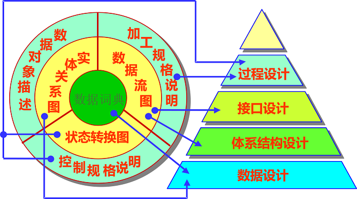</div>

* 根据用信息域表示的软件需求，以及功能和性能需求，软件设计过程有：
	* 数据设计：将实体 – 关系图中描述的对象和关系，以及数据词典中描述的详细数据内容转化为数据结构的定义。
	* 体系结构设计：定义软件系统各主要成份之间的关系。   
	* 过程设计：把结构成份转换成软件的过程性描述。
	* 接口设计：接口设计根据数据流图定义软件内部各成份之间、软件与其它协同系统之间及软件与用户之间的交互机制。

# 4.2 设计原理

### 4.2.1 模块化

* 模块：是由边界元素限定的相邻程序元素的序列，而且有一个总体标识符代表它。
* 模块化：就是把程序划分成独立命名且可独立访问的模块，每个模块完成一个子功能，把这些模块集成起来构成一个整体，可以完成指定的功能满足用户的需求。 

* 模块化的优点
	* 易于维护；
	* 易于分工合作；
	* 易于扩充功能;
	* 易于模块化测试。
	* 块内代码量30-60
* 模块个数适中
	* 每个程序都相应地有一个最适当的模块数目M，使得系统的开发成本最小。 

   <div align="center">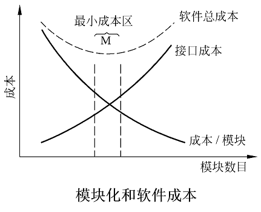</div>

### 4.2.2 抽象与逐步求精
* 抽象：现实世界中一定事物、状态或过程之间总存在着某些相似的方面(共性)。把这些相似的方面集中和概括起来，暂时忽略它们之间的差异，这就是抽象。
	* 抽象就是抽出事物本质特性而暂时不考虑细节。例如参考文档。
	* “抽象是人类处理复杂问题的基本方法之一。”            ——Grady Boach
* 逐步求精：为了能集中精力解决主要问题而尽量推迟对问题细节的考虑。
	* 集中精力在与当前开发阶段相关的那些方面上，忽略那些必须的，但不是马上要考虑的东西。 
	* 举例：第三章数据流图的画法
	* Miller法则：一个人在任何时候都只能把注意力集中在（7±2）个知识块上。 

* 一般抽象过程：
	* 处理复杂系统的惟一有效的方法是用层次的方式构造和分析它。
	* 一个复杂的动态系统首先可以用一些高级的抽象概念构造和理解，这些高级概念又可以用一些较低级的概念构造和理解，如此进行下去，直至最低层次的具体元素。 
	* 例：过程抽象（数据流图）、数据抽象（层次图的画法）

### 4.2.3 信息隐藏和局部化
* 信息隐藏：应该这样设计和确定模块，使得一个模块内包含的信息(过程和数据)对于不需要这些信息的模块来说，是不能访问的。**优点**：
	* 防止其它模块访问局部数据
	* 对局部数据进行维护，不需要考虑其它模块
* 局部化：局部化的概念和信息隐藏概念是密切相关的。所谓局部化是指把一些关系密切的软件元素物理地放得彼此靠近。显然，局部化有助于实现信息隐藏。

# 4.3 模块独立
* 模块独立：
	* 希望这样设计软件结构，使得每个模块完成一个相对独立的特定子功能，并且和其他模块之间的关系很简单。
	* 模块独立的概念是模块化、抽象、信息隐藏和局部化概念的直接结果。
* 模块独立程度的两个定性标准度量：
	* 耦合:就是指两个或两个以上的实体相互依赖于对方的一个量度。在软件工程中，衡量不同模块彼此间互相依赖(连接)的紧密程度。
		* 紧密：耦合高。不紧密：耦合低。
	* 内聚衡量一个模块内部各个元素彼此结合的紧密程度。内聚要高，每个模块完成一个相对独立的特定子功能。 
		* **希望低耦合，高内聚**

* 各种耦合对比

   <div align="center"></div>

### 4.3.1 耦合(程度的度量)
* (1)非直接耦合/完全独立(no direct coupling)
	* 如果两个模块中的每一个都能独立地工作而不需要另一个模块的存在，那么它们完全独立。
	* 在一个软件系统中不可能所有模块之间都没有任何连接。

   <div align="center">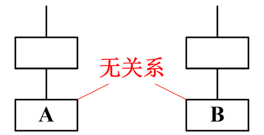</div>

* (2)数据耦合(data coupling)
	* 如果两个模块彼此间通过参数交换信息，而且交换的信息仅仅是数据，那么这种耦合称为数据耦合。
	
	   <div align="center">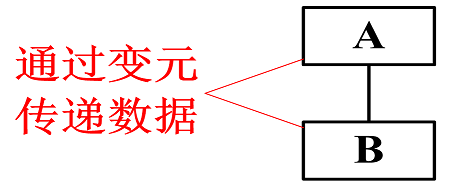</div>

	* 评价：
		* 系统中至少必须存在这种耦合。一般说来，一个系统内可以只包含数据耦合。
		* 数据耦合是理想的目标。
		* 维护更容易，对一个模块的修改不会使另一个模块产生退化错误。 


* (3)控制耦合(control coupling)
	* 如果两个模块彼此间传递的信息中有控制信息，这种耦合称为控制耦合。 

	   <div align="center">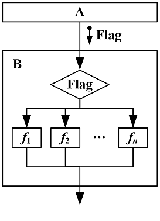</div>

	* 评价：
		* 控制耦合往往是多余的，把模块适当分解之后通常可以用数据耦合代替它。
		* 被调用的模块需知道调用模块的内部结构和逻辑，降低了重用的可能性 。

* (4)特征耦合(stamp coupling)-数据结构耦合
	* 当把整个数据结构作为参数传递而被调用的模块只需要使用其中一部分数据元素时，就出现了特征耦合。
	* 评价：
		* 被调用的模块可使用的数据多于它确实需要的数据，这将导致对数据的访问失去控制，从而给计算机犯罪提供了机会。
		* 无论何时把指针作为参数进行传递，都应该仔细检查该耦合。

* (5)公共环境耦合(common coupling)
	* 一个模块往公共环境送数据，另一个模块从公共环境取数据。即允许一组模块访问同一全局性的数据结构。数据耦合的一种形式。是比较松散的耦合。 如静态变量

	   <div align="center">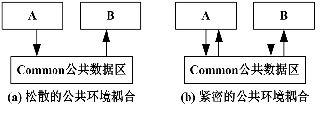</div>

* (6)内容耦合(content coupling)
	* 最高程度的耦合是内容耦合。如果出现下列情况之一，两个模块间就发生了内容耦合：
		* 一个模块访问另一个模块的内部数据；
		* 一个模块不通过正常入口转到另一个模块的内部；如使用goto。
		* 两个模块有一部分程序代码重叠；
		* 一个模块有多个入口。 

	   <div align="center">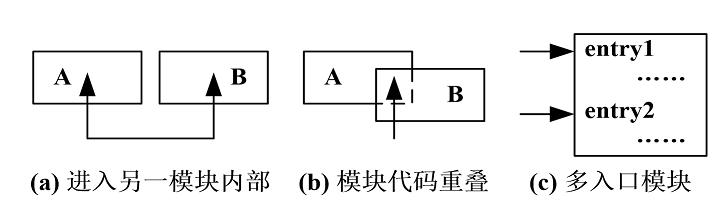</div>


### 4.3.2 内聚
* 内聚：标志一个模块内各个元素彼此结合的紧密程度，它是信息隐藏和局部化概念的自然扩展。简单地说，理想内聚的模块只做一件事情。
* 要求：内聚有七类。设计时应该力求做到高内聚，通常中等程度的内聚也是可以采用的，而且效果和高内聚相差不多；但是，低内聚不要使用。

----------------------------
* (1)偶然内聚(coincidental cohesion)
	* 如果一个模块的各成分之间毫无关系，则称为偶然内聚。
	* 例如：统计学生英语的平均成绩 和修改id为**的老师的基本信息 
	* 或者 发现一组语句在两处或多处出现，于是把这些语句作为一个模块以节省内存，也是偶然内聚。

  ```cpp
  move(point q ,point p)
  {
  	q=p;
  	p=p->next;
  }
  ```
	* 评价：
		* 模块内各元素之间没有实质性联系，很可能在一种应用场合需要修改这个模块，在另一种应用场合又不允许这种修改，从而陷入困境；
		* 可理解性差，可维护性产生退化；
		* 模块是不可重用的。

* (2)逻辑内聚(logical cohesion)
	* 如果一个模块完成的任务在逻辑上属于相同或相似的一类，则称为逻辑内聚。
	*举例：一个子程序将打印季度开支报告、月份开支报告和日开支报告．
		* 具体打印哪一个，将由传入的控制标志决定，这个子程序具有逻辑内聚性，因为它的内部逻辑是由输进去的外部控制标志决定的。

	* 评价：
		* 接口难以理解，造成整体上不易理解；
		* 完成多个操作的代码互相纠缠在一起，即使局部功能的修改有时也会影响全局，导致严重的维护问题；
		* 难以重用。
	* 解决方案：
		* 模块分解。 

* (3)时间内聚(temporal cohesion)经典内聚
	* 如果一个模块包含的任务必须在同一段时间内执行，就叫时间内聚。
	* 例如：初始化模块。初始化模块要为所有全局变量赋初值，对所有介质上的文件置初态，初始化寄存器和栈等，因此要求在程序开始执行的最初一段时间内，模块中所有功能全部执行一遍。
	* Windows初始化： 初始化引导载入程序、操作系统选择、硬件检测、硬件配置文件。
	* 评价：
		* 时间关系在一定程度上反映了程序某些实质，所以时间内聚比逻辑内聚好一些。
		* 模块内操作之间的关系很弱，与其他模块的操作却有很强的关联。
		* 时间内聚的模块不太可能重用。

 * (4)过程内聚(procedural cohesion)
	* 如果一个模块内的处理元素是相关的，而且必须以特定次序执行，则称为过程内聚。
	* 这些操作原本并不需要关联到一起，只是因为人为的赋予特定的顺序。
		* 比如，银行接收用户信息模块，要求：必须是先输入身份证号（审核），后输入姓名，然后是密码（密码）
	* 评价：
		* 比时间内聚好，至少操作之间是过程关联的。
		* 仍是弱连接，不太可能重用模块。

* (5)通信内聚(communicational cohesion)
	* 如果模块中所有元素都使用同一个输入数据和(或)产生同一个输出数据，则称为通信内聚。即在同一个数据结构上操作。
	* 更新某个数据时，先查找是否存在，然后再执行更新或插入操作。  (具体操作可以通过调用函数实现)
		* 比如：统计数学成绩的平均成绩及80分以上人数。

		  ```cpp
		  sum=0;     
		  for（i=1;i<=50;i++）
		  {
		  	sum=sum+maths[i];
		  	if(maths[i]>=80)
		         count++;
		  }
		  ………
		  ```
	* 评价：
		* 模块中各操作紧密相连，比过程内聚更好。
		* 不能重用。
	* 解决方案：
		* 分成多个模块，每个模块执行一个操作。

* (6) 顺序内聚(sequential cohesion)
	* 如果一个模块的各个成分和同一个功能密切相关，而且一个成分的输出作为另一个成分的输入，则称为顺序内聚 。

	* 评价：
		* 根据数据流图划分模块时，通常得到顺序内聚的模块，这种模块彼此间的连接往往比较简单。 

	* eg：
		* 操作1：根据ID获取名称，判断名称是否为空。
		* 操作2：将名字转成小写。

		  ```cpp
		  void print_name(id)
		  {
		  	const char* name = get_name(id);
		  	if (name == NULL)
		  	{
		  		// printf(“名称为空”);
		  		return;
		  	}
		  	else  
		  	{
		  		printf(name);tolower(name);
		  	}
		  }
		  ```
* (7)功能内聚(functional cohesion)
	* 如果模块内所有处理元素属于一个整体(每个处理都是必不可少)，完成一个单一的功能，则称为功能内聚。功能内聚是最高程度的内聚。
	* 举例：
	* 评价：
		* 模块可重用，应尽可能重用；
		* 可隔离错误，维护更容易；
		* 扩充产品功能时更容易。


* 七种内聚的优劣评分结果：
	* 高内聚：
		* 功能内聚     10分
		* 顺序内聚	   9分		
	* 中内聚：
		* 通信内聚	    7分		
		* 过程内聚	    5分
	* 低内聚：
		* 时间内聚	    3分
		* 逻辑内聚	    1分
		* 偶然内聚	    0分
* 设计时力争做到高内聚，并且能够辨认出低内聚的模块。 

# 4.4 启发规则

* 1.改进软件结构提高模块独立性
	* 通过模块分解或合并，降低耦合提高内聚。
		* 模块功能完善化。一个完整的模块包含：
			* 执行规定的功能的部分
			* 出错处理的部分
			* 返回一个“结束标志”
* 2.模块规模应该适中
	* 经验表明，一个模块的规模不应过大，最好能写在一页纸内(通常不超过60行语句)。
	* 过大的模块往往是由于分解不充分，但是进一步分解必须符合问题结构，一般说来，分解后不应该降低模块独立性。
	* 过小的模块，可能未完成一个子功能。或模块数目过多将使系统接口复杂。

* 3.深度、宽度、扇出和扇入都应适当
	* 🔥深度 ：软件结构中控制的层数，它往往能粗略地标志一个系统的大小和复杂程度。
	* 🔥宽度：软件结构内同一个层次上的模块总数的最大值。
	* 🔥扇出：一个模块直接控制(调用)的模块数目。
	* 🔥扇入：有多少个上级模块直接调用它。

	   <div align="center">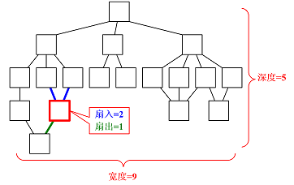</div>

	* 深度：应适当。否则可能是模块划分过细，未完成一个完整子功能。增加接口成本消耗。

	   <div align="center">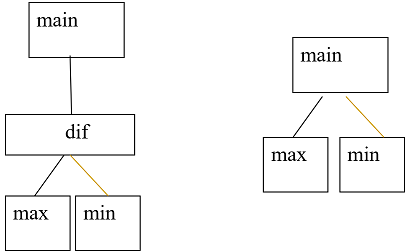</div>

	  ```cpp
	  #include <stdio.h>
	  int dif(int x,int y,int z);
	  int max(int x,int y,int z);
	  int min(int x,int y,int z);
	  void main()
	  {
	    	int a,b,c,d;
	  	scanf("%d%d%d",&a,&b,&c);
	  	d=dif(a,b,c);
	  	printf("Max-Min=%d\n",d);
	  }
	  int max(int x,int y,int z)
	  {    
	  	int r;
	  	r=x>y?x:y;
	  	return(r>z?r:z);
	  }
	  int min(int x,int y,int z)
	  {   
	  	int r;
	  	r=x<y?x:y;
	  	return(r<z?r:z);
	  }
	  int dif(int x,int y,int z)
	  {  
	  	return max(x,y,z)-min(x,y,z); 
	  }
	  ```

		* 解决办法：
			* （1）将一些模块与其父模块合并，减少深度。 
			* （2）将子模块提升到父模块同一层次

	* 宽度：应适当，若多，模块间协调花费就大。可能抽象不够。（影响扇入扇出）

	   <div align="center">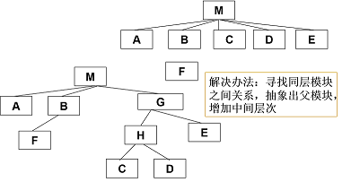</div>

	   <div align="center">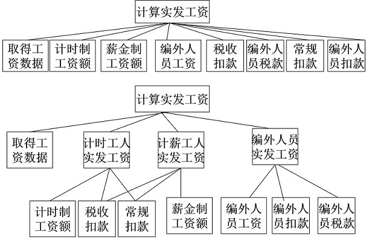</div>

	* 观察大量软件系统后发现，设计得很好的软件结构通常**顶层扇出比较高，中层扇出较少，底层扇入到公共的实用模块中去(底层模块有高扇入)**。

* 4.模块的作用域应该在控制域之内
	* 模块的作用域：定义为受该模块内一个判定影响的所有模块的集合。（如下例）
	* 模块的控制域：是这个模块本身以及所有直接或间接从属于它的模块的集合。 
	* 在一个设计得很好的系统中，所有受判定影响的模块应该都从属于做出判定的那个模块，最好局限于做出判定的那个模块本身及它的直属下级模块。
	* 如果模块的作用域不在控制域之内，则会增加模块间数据的传递量，使模块间出现控制耦合。

	   <div align="center">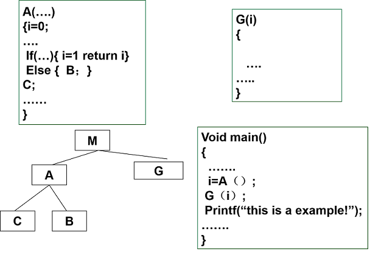</div>

	* 解决方案：
		* 把模块A中的判定移到模块M中；
		* 把模块G移到模块A下面，作为他的下级模块。 

	   <div align="center">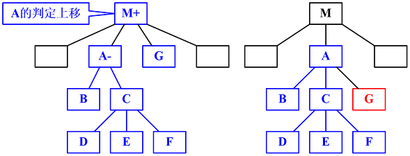</div>

* 5.力争降低模块接口的复杂程度
	* 模块接口复杂是软件发生错误的一个主要原因。应该仔细设计模块接口，使得信息传递简单易懂并且和模块的功能一致。

	>例：解一元二次方程的函数

	* QUAD_ROOT(TBL,X)
		* 其中数组TBL传送方程的系数
		* 数组X送回求得的根
	* QUAD_ROOT(A,B,C,ROOT1,ROOT2)

* 6.设计单入口单出口的模块
	* 警告软件工程师不要使模块间出现内容耦合。当从顶部进入模块并且从底部退出来时，软件是比较容易理解的，因此也是比较容易维护的。
* 7.模块功能应该可以预测
	* 模块的功能应该能够预测，但也要防止模块功能过分局限。
	* 功能可预测：如果一个模块可以当做一个黑盒子，只要输入的数据相同就产生同样的输出，这个模块的功能就是可以预测的。


